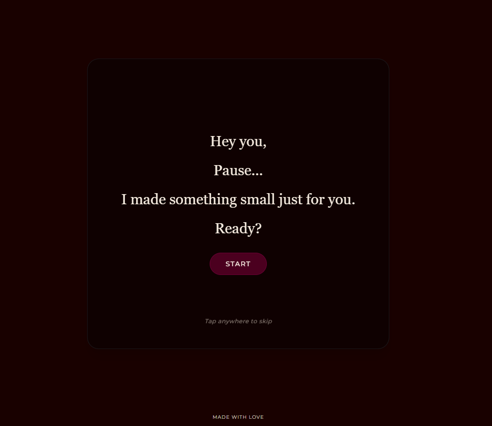
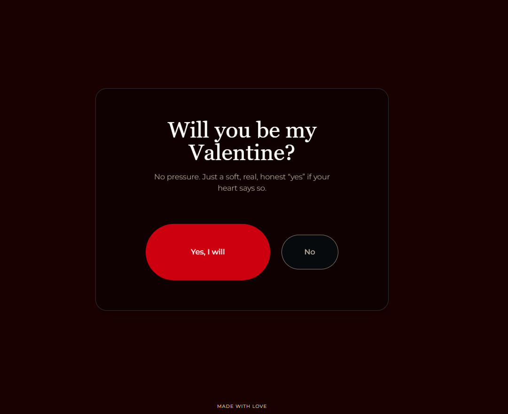

# Valentine's Surprise

Private, simple Valentine question website with a playful, three-screen flow.

## What It Is
A single-page experience with three screens:
1. **Intro** — a warm welcome and “Start” prompt.
2. **Question** — the main Valentine question with playful interaction.
3. **Yes** — the celebratory acceptance screen and reset option.

## App Functionality (Quick Tour)
1. The **Intro** screen invites the user to begin.
2. The **Question** screen lets them respond and triggers the final screen.
3. The **Yes** screen celebrates and offers a **Restart** to loop the experience.
4. Background music can be toggled and is persisted in local storage.

## Run Locally
1. `npm install`
2. `npm run dev`

## Build
1. `npm run build`
2. `npm run preview`

## Deployment
This is a Vite + React app. Most static hosts work with:
- Build command: `npm run build`
- Output folder: `dist`

You will also need to set the `GEMINI_API_KEY` environment variable in your hosting provider.

### Vercel (Selected)
1. Create a new Vercel project and import this repo.
2. Framework preset: `Vite`.
3. Build command: `npm run build`.
4. Output directory: `dist`.
5. Add environment variable `GEMINI_API_KEY` in Vercel Project Settings.
6. Deploy.

## Notes
- Intended for private use.
